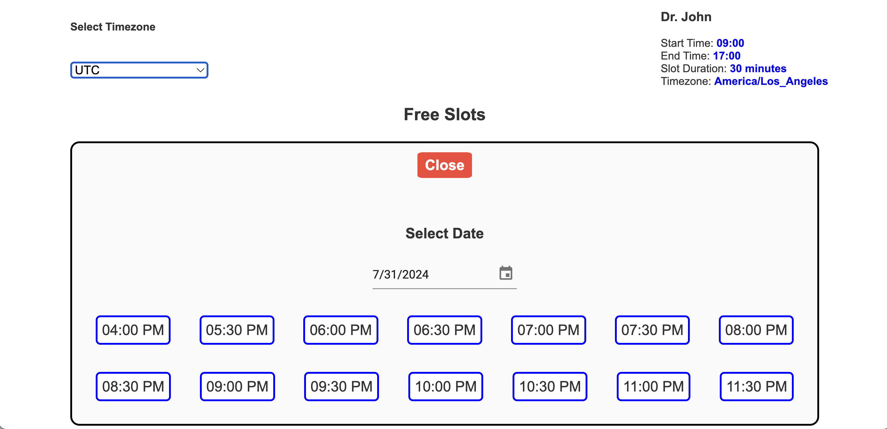
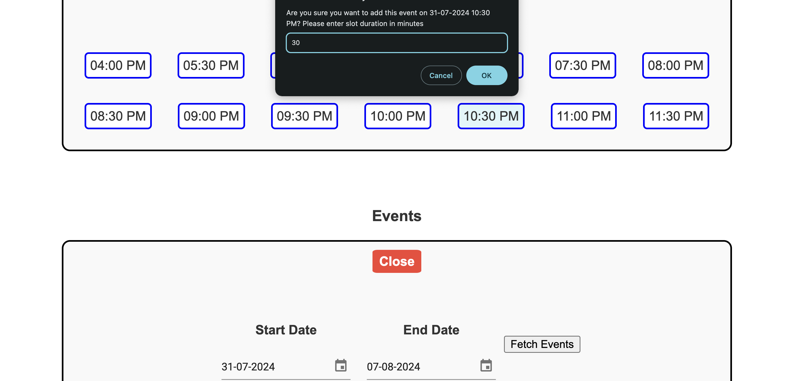
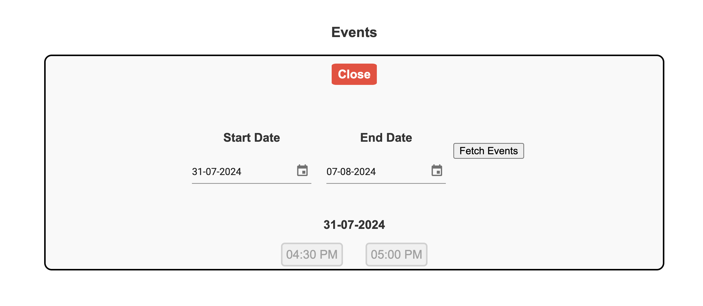

# HighLevelEvents





After installing all dependencies, run the following command to start both the backend and frontend servers:

```bash
npm run both
```

## API Endpoints

### `/config`

**Description:** Gets Dr John's information.

### `/add_event`

**Description:** Adds an event to the Firestore database.

**Query Parameters:**
- `timestamp` (required): The timestamp of the event.
- `duration` (optional): Duration of the event in minutes.

### `/events`

**Description:** Retrieves events from the database.

**Query Parameters:**
- `start` (required): Start date in DD-MM-YYYY format.
- `end` (required): End date in DD-MM-YYYY format.

### `/free_slots`

**Description:** Returns all free slots available on a particular date.

**Query Parameters:**
- `date` (required): The date to check for free slots (in DD-MM-YYYY format).
- `timezone` (required): Timezone of the date.
